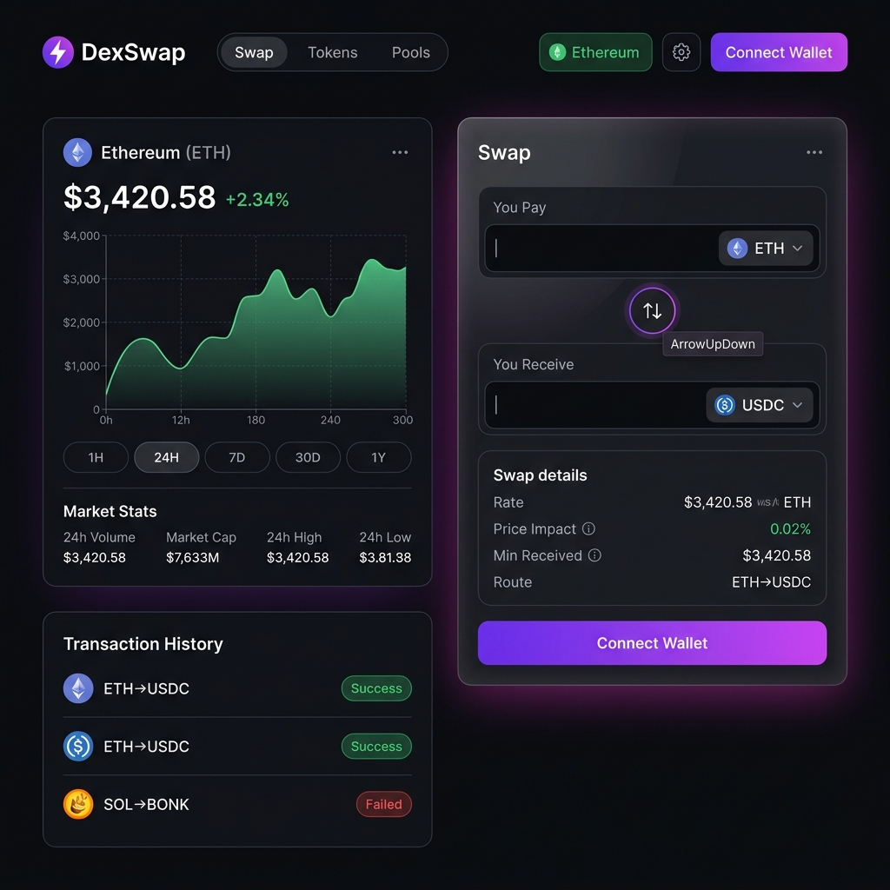
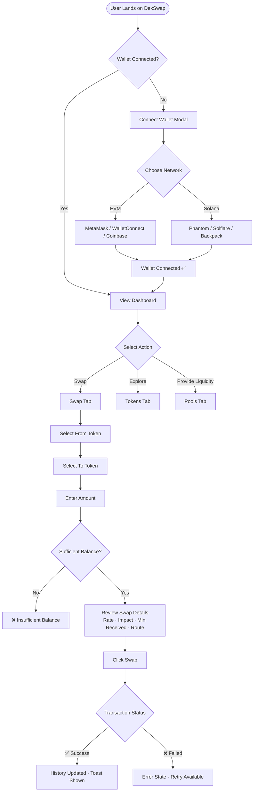
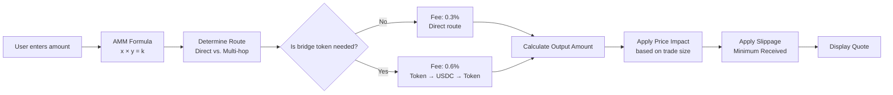
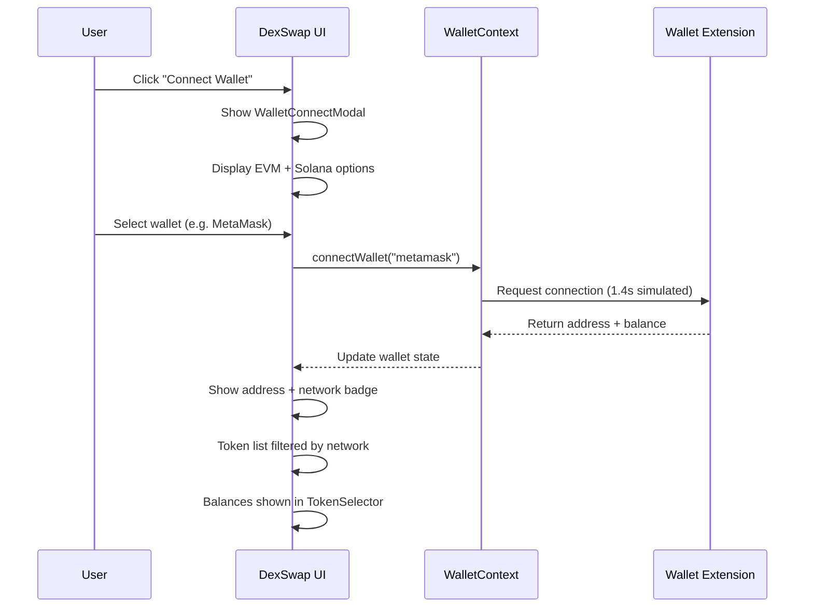
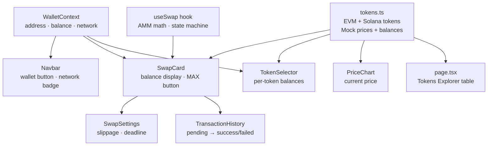

<div align="center">


</div>

<div align="center">

# ⚡ DexSwap

### A Uniswap-like Decentralized Exchange Frontend

**Trade any token instantly across EVM chains and Solana — with a premium, glassmorphic dark UI.**

[Live Demo](#getting-started) · [Features](#-features) · [Architecture](#-architecture) · [Wallet Support](#-wallet-support) · [Contributing](#-contributing)

---

</div>

## 📸 Screenshots

### 🏠 Swap Dashboard — Main Page


The main dashboard shows:
- **Top Navbar**: DexSwap logo, Swap/Tokens/Pools navigation pills, Ethereum network badge, Settings gear, and "Connect Wallet" button
- **Left Panel**: ETH price chart (`$3,420.58` / `+2.34%`) with a green Recharts area chart, period selectors (1H / 24H / 7D / 30D / 1Y), and Market Stats bar (24h Volume, Market Cap, 24h High/Low). Below: Transaction History with ETH→USDC (Success), SOL→BONK (Failed) entries
- **Right Panel**: Swap widget — "You Pay" ETH input, ArrowUpDown flip button, "You Receive" USDC input, Swap Details section (Rate, Price Impact 0.02% in green, Min Received, Route), purple "Connect Wallet" CTA

---

### 🔄 Swap Widget States

The swap card features **real-time AMM pricing**, token balances, price impact warnings, and simulated routing:

| State | Description |
|-------|-------------|
| `Connect Wallet` | User not connected — prompt to connect |
| `Select Tokens` | Wallet connected, tokens not chosen yet |
| `Enter an Amount` | Tokens selected, awaiting input |
| `Insufficient Balance` | Amount exceeds wallet balance (danger CTA) |
| `Swap →` | All valid — executes the swap |
| `Swapping...` | Pending blockchain confirmation |
| `Confirmed ✅` | Transaction success animation |

---

### 📊 Token Explorer Tab
Full token table listing EVM and Solana tokens with:
- Token logo badge with brand color
- Network badges: **EVM** (indigo) or **Solana** (green)
- Live price display with 2–8 decimal precision
- 24h % change in **green** (positive) or **red** (negative)
- "Trade" button on each row

Tokens shown: ETH, SOL, WBTC, USDC, UNI, LINK, AAVE, MATIC, JUP, BONK, RAY

---

### 🏊 Liquidity Pools Tab
Pools panel with:
- Token pair display (overlapping circular icons)
- TVL, 24h Volume, Fee Tier, APY columns
- "Add Liquidity" CTA per row
- "+ New Position" button in the header

Pools shown: ETH/USDC ($842M TVL), WBTC/ETH, SOL/USDC, ETH/USDT, UNI/ETH

---

### 🔗 Wallet Connect Modal
Triggered by "Connect Wallet" — shows:
- Feature pills: Non-Custodial · Instant Swaps · Multi-Chain
- **EVM Section**: 🦊 MetaMask (Popular), 🔗 WalletConnect, 🔵 Coinbase Wallet
- **Solana Section**: 👻 Phantom (Popular), ☀️ Solflare, 🎒 Backpack
- Hover effect slides each option rightward with `›` arrow


---

## ✨ Features

### 💱 Swap Engine
- Constant-product AMM formula (`x × y = k`) for realistic price simulation
- Multi-hop routing simulation (Token A → USDC → Token B)
- Real-time price impact calculation
- Configurable slippage tolerance (0.1% / 0.5% / 1.0% / custom)
- Transaction deadline setting
- Minimum received calculation with slippage applied

### 📈 Price Charts
- Interactive area charts powered by **Recharts**
- 5 time periods: `1H` `24H` `7D` `30D` `1Y`
- 5 tokens: ETH, SOL, WBTC, UNI, LINK
- Dynamic green/red gradient fills based on price direction
- Market stats: Volume, Market Cap, 24h High/Low
- Custom animated tooltip

### 🌐 Multi-Network
- **EVM chains**: Ethereum, BNB Chain, Polygon, Arbitrum, Optimism
- **Solana**: SOL, SPL tokens
- Network badge in navbar reflects connected chain
- Token lists filtered by active network

### 📜 Transaction History
- Filter by: All / Success / Pending / Failed
- Gas cost & price impact per transaction
- Direct explorer links (Etherscan for EVM, Solscan for Solana)
- Relative timestamps (`2m ago`, `1h ago`)

### 🎨 Design System
- Full HSL dark theme design tokens
- Glassmorphism cards with `backdrop-filter: blur(20px)`
- Purple → Pink gradient accents
- 8 CSS animations: `fadeIn`, `slideUp`, `bounceIn`, `pulseGlow`, `float`, `spin`, `shimmer`, `ripple`
- Google Fonts: **Inter** (body) + **Space Grotesk** (headings/numbers)
- Responsive layout (collapses to single column on `<900px`)

---

## 🔗 Wallet Support

| Wallet | Network | Type |
|--------|---------|------|
| 🦊 **MetaMask** | Ethereum / EVM | Browser Extension |
| 🔗 **WalletConnect** | EVM | QR Code / Mobile |
| 🔵 **Coinbase Wallet** | EVM | Extension / Mobile |
| 👻 **Phantom** | Solana | Browser Extension |
| ☀️ **Solflare** | Solana | Browser Extension |
| 🎒 **Backpack** | Solana | xNFT Wallet |

---

## 🏗️ Architecture

```
D:\Projects\NodeJS\Dex_Swap\
├── src/
│   ├── app/
│   │   ├── globals.css          # Design system: tokens, glass, animations
│   │   ├── layout.tsx           # Root layout + WalletProvider wrapper
│   │   └── page.tsx             # Main page: Swap | Tokens | Pools tabs
│   │
│   ├── components/
│   │   ├── Navbar.tsx           # Top navigation, wallet status, network badge
│   │   ├── SwapCard.tsx         # Core Uniswap-like swap widget
│   │   ├── TokenSelector.tsx    # Token picker modal with search + balances
│   │   ├── SwapSettings.tsx     # Slippage & deadline settings popover
│   │   ├── PriceChart.tsx       # Recharts area chart with period selectors
│   │   ├── TransactionHistory.tsx # Recent swaps panel with status + explorer links
│   │   └── WalletConnectModal.tsx # Multi-wallet selection UI
│   │
│   ├── context/
│   │   └── WalletContext.tsx    # Global wallet state (connect/disconnect)
│   │
│   ├── constants/
│   │   └── tokens.ts            # EVM + Solana token registry, mock prices & balances
│   │
│   └── hooks/
│       └── useSwap.ts           # AMM math, route simulation, swap state machine
│
├── public/
│   └── screenshots/             # App screenshots for documentation
│
├── package.json
├── next.config.ts
└── tsconfig.json
```

---

## 🔄 Application Flow Diagrams

### User Journey Flow



---

### Swap Pricing Engine



---

### Wallet Connection Flow



---

### Component Data Flow



---

## 🚀 Getting Started

### Prerequisites

- **Node.js** ≥ 18.x
- **npm** ≥ 9.x

### Installation

```bash
# 1. Clone the repository
git clone https://github.com/yourusername/dex-swap.git
cd dex-swap

# 2. Install dependencies
npm install

# 3. Start the development server
npm run dev
```

Open **http://localhost:3000** in your browser.

### Build for Production

```bash
npm run build
npm run start
```

---

## 📦 Tech Stack

| Category | Technology |
|----------|-----------|
| **Framework** | Next.js 16.2.10 (App Router, Turbopack) |
| **UI Library** | React 19.2.4 |
| **Language** | TypeScript 5.x |
| **Charting** | Recharts |
| **Icons** | Lucide React |
| **Animations** | Framer Motion + CSS Keyframes |
| **Fonts** | Inter + Space Grotesk (Google Fonts) |
| **Styling** | Vanilla CSS Modules + CSS Custom Properties |
| **Linting** | ESLint (Next.js config) |

---

## 🌐 Supported Tokens

### EVM Tokens

| Symbol | Name | Decimals |
|--------|------|----------|
| ETH | Ethereum | 18 |
| USDC | USD Coin | 6 |
| WBTC | Wrapped Bitcoin | 8 |
| USDT | Tether USD | 6 |
| UNI | Uniswap | 18 |
| LINK | Chainlink | 18 |
| AAVE | Aave | 18 |
| MATIC | Polygon | 18 |

### Solana Tokens

| Symbol | Name | Decimals |
|--------|------|----------|
| SOL | Solana | 9 |
| USDC | USD Coin | 6 |
| BONK | Bonk | 5 |
| JUP | Jupiter | 6 |
| RENDER | Render Token | 8 |
| RAY | Raydium | 6 |

---

## 🔧 Key Implementation Details

### AMM Constant-Product Formula

The swap engine uses the standard `x × y = k` formula used by Uniswap v2:

```typescript
const simulateAMMOutput = (
  amountIn: number,
  reserveIn: number,
  reserveOut: number,
  feeTier: number = 0.003   // 0.3% fee
): number => {
  const amountInWithFee = amountIn * (1 - feeTier);
  const numerator = amountInWithFee * reserveOut;
  const denominator = reserveIn + amountInWithFee;
  return numerator / denominator;
};
```

### Price Impact Tiers

```typescript
// Price impact scales with trade size in USD
< $100    → 0.01% impact
< $1,000  → 0.05% impact
< $10,000 → 0.15% impact
< $100,000 → 0.45% impact
≥ $100,000 → 1.20% impact
```

### Slippage Warnings

| Slippage | Warning |
|----------|---------|
| ≤ 0.1% | ⚡ Low slippage — may fail in volatile markets |
| 0.1% – 5% | ✅ Normal |
| > 5% | ⚠️ High slippage — may be frontrun |

---

## 📁 Environment Variables

No environment variables are required for local development. The app uses a local mock data system for wallet balances and token prices.

To integrate with real blockchain RPCs, create a `.env.local` file:

```env
# EVM RPC (optional — for real wallet integration)
NEXT_PUBLIC_ETHEREUM_RPC=https://mainnet.infura.io/v3/YOUR_KEY
NEXT_PUBLIC_WALLETCONNECT_PROJECT_ID=your_project_id

# Solana RPC (optional — for real Solana wallet integration)
NEXT_PUBLIC_SOLANA_RPC=https://api.mainnet-beta.solana.com
```

---

## 🗺️ Roadmap

- [ ] 🔗 Connect to real Ethereum RPC via `wagmi` + `viem`
- [ ] 👻 Connect to real Solana via `@solana/wallet-adapter-react`
- [ ] 📡 Live token prices via CoinGecko or 1inch API
- [ ] 🌉 Cross-chain bridge UI (ETH ↔ SOL)
- [ ] 💧 Real Uniswap V3 pool data integration
- [ ] 🔔 Push notifications for confirmed transactions
- [ ] 📱 Mobile-optimized layout
- [ ] 🌐 Localization (i18n)

---

## 🤝 Contributing

1. Fork the repository
2. Create your feature branch: `git checkout -b feature/add-bridge-support`
3. Commit your changes: `git commit -m 'feat: add cross-chain bridge UI'`
4. Push to the branch: `git push origin feature/add-bridge-support`
5. Open a Pull Request

---

## 📄 License

This project is licensed under the **MIT License** — see the [LICENSE](LICENSE) file for details.

---

<div align="center">

Built with ⚡ by the DexSwap team · Inspired by [Uniswap](https://uniswap.org)

**Star ⭐ this repo if you found it useful!**

</div>
